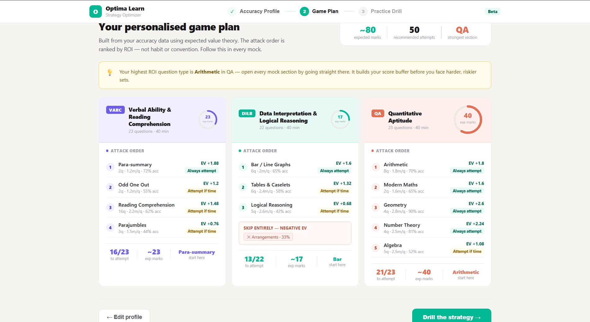

# CAT Attempt Strategy Optimizer

A decision-support prototype that helps CAT aspirants maximize their score by converting accuracy insights into a clear, actionable attempt strategy.

🔗 **Live Demo:** https://aaayyuusshhh.github.io/cat-strategy-optimizer/

## Preview

---

## Problem

User conversations revealed a consistent and critical gap: most CAT aspirants are aware of their strengths and weaknesses, but fail to apply that awareness during mocks.

Under time pressure, attempt decisions are largely instinct driven. Students often attempt questions from weak areas, hesitate on solvable ones, and lose marks due to poor judgment rather than lack of knowledge.

Current platforms, including Optima, focus on post-test analysis. However, they do not support the most important layer, decision-making during the test itself.

---

## Why this matters

CAT is not just a test of accuracy, but of decision quality under constraints.

Users repeatedly described patterns such as:

* Attempting questions they knew were risky
* Spending excessive time deciding whether to attempt or skip
* Entering sections without a defined plan

These behaviors directly impact scores through negative marking and inefficient time allocation.

This highlights a clear gap between awareness and execution.

---

## Solution

This prototype introduces a decision layer that translates a user’s accuracy profile into a structured attempt strategy.

Instead of relying on instinct, it provides:

* Clear guidance on which questions to attempt, defer, or skip
* Prioritized sequencing of question types
* A repeatable framework for in-test decision-making

---

## How it works

1. Users input their accuracy across different question types
2. The system calculates expected value using CAT’s +3 / -1 scoring
3. Each question type is classified into:

   * Always attempt
   * Attempt if time permits
   * Skip
4. A prioritized game plan is generated to guide execution

---

## Key Insight

The core problem is not lack of preparation, but lack of structured decision-making.

Most aspirants already have the data needed to perform better. What’s missing is a system that converts that awareness into consistent, high-quality decisions under pressure.

---

## Integration with Optima

This can be integrated as a “Build Your Strategy” layer immediately after mock analysis.

After presenting performance insights, Optima can:

* Translate accuracy metrics into actionable strategies
* Enable users to simulate and internalize attempt decisions
* Improve actual test outcomes, not just post-test understanding

This shifts the product from analysis to real performance enablement.

---

## Tech Stack

* Frontend: React / JavaScript
* No backend required
* Expected value based decision logic
* Local storage for lightweight persistence

---

## Note

This is a working prototype built to demonstrate a real, user-validated problem and its solution. It is not production-ready, but focuses on delivering a high-impact decision-support layer that is currently missing in CAT preparation tools.
